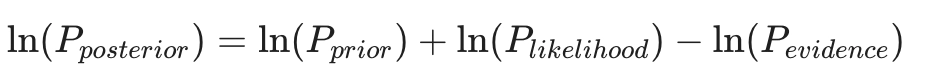

**The Goal:** Build a high-performance filtering tool that calculates the probability of being in a "High Volatility/Bear" vs. "Low Volatility/Bull" market state in real-time using recursive Bayesian updates (Log-Likelihood).

---

## 🛠️ Technical Specifications

### 1. The Mathematical Core

Instead of processing a whole dataset at once, implement a **Recursive Update**.

- **Prior:** Your belief about the market at time t.
- **Likelihood:** How well the new price return r_t+1 fits the "Bull" vs "Bear" normal distributions.
- **Posterior:** Your updated belief after seeing the new data.

To avoid floating-point underflow (a critical numerical stability requirement), you must perform all calculations in **Log-Space**:

### 2. The System Architecture

- **Data Ingestion:** Create a class-based structure that accepts a "stream" of returns (simulated or historical).
- **Numerical Stability:** Use `math.log` or `numpy.log` to ensure the probabilities don't hit absolute zero over long time series.
- **Performance:** If using Python, vectorize the likelihood calculation for the entire history to compare against the recursive "live" version.

---

## 📋 The Updated Feature List

- **Dual-Distribution Modeling:** Define two regimes:
  
- **The "Hysteresis" Filter:** Add a "Transition Matrix" (Ross Ch 4/Markov concepts). This represents the probability that if we are in a Bull market today, we stay in it tomorrow (e.g., 95%). This prevents the signal from "flickering" on every small price move.
- **Visualizer:** A plot showing the price series on top and the "Probability of Bear Market" (0 to 1) on the bottom.

---

## 🚀 Strategic Applications:

1. **Directly Applicable Integration:** This engine serves as the foundational layer for **Trend Following** and **Dynamic Asset Allocation** strategies.
2. **Computational Robustness:** It demonstrates the ability to safely implement continuous-time continuous-space mathematics (log-probabilities, $O(1)$ memory management) in a production environment.
3. **Regime Shift Adaptability:** By dynamically tracking regime shifts using an Online Hidden Markov Model (HMM), the engine rapidly adapts portfolio exposure without relying on lagging indicators like moving averages.
